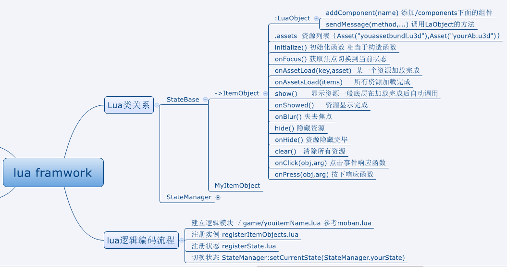

###Hugula 游戏框架 

Hugula是一个基于unity3d+lua技术的免费开源游戏框架，特点。

1. 全lua逻辑:
  基于mvvm，和状态模式；view和逻辑完全解耦，界面采用数据绑定技术，界面组合切换基于状态模式，包含引用计数，对象池，自动资源回收等功能，能极大提高开发速度。

2. 热更新:
 完善的更新流程，支持md5加密，crc校验，跨版本更新。

3. [帮助文档](https://github.com/tenvick/hugula/wiki)  交流qq群：19324776。

4. [mvvm 使用文档](https://github.com/tenvick/hugula/wiki/hugula-mvvm-%E4%BD%BF%E7%94%A8)
 
##本框架需要以下条件

1)unity3d 推荐5.3以上

2)slua项目 地址 https://github.com/pangweiwei/slua

3)如需使用tools辅助功能 需要配置python2.7 lua5.1环境

##框架目录

Assets

-Config               （存放xxx.csv 配置文件 使用菜单 Hugula/export config [Assets\Config]导出）

-CustomerResource     （存放美术资源）

-Hugula               （核心代码）

-Scene                （场景 begin为开始场景）

-Slua                 （Slua插件）

-Tmp                  （编译lua文件临时存放目录）

-Lua                  （lua脚本）

##运行发布

1. 一键发布 Hugula -> Build For Publish (首次运行或者发布时候)
2. 导出slua接口

 2.1 Slua/All/Make   导出slua所需要的wrap类。

 2.2 如果打开有报错 Slua/All/Clear	清理已经生成的wrap类
 
## 其他导出
1. 导出资源

 1.1  AssetBundles/Build AssetBundles 导出assetbundle资源

 1.2  AssetBundles/Generate/AssetBundle Update File  导出更新差异包和版本号等信息 
 
 1.3  AssetBundles/Generate/AssetBundle Md5Mapping  真实名字Md5映射值表

1. 导出其他 

 2.1 Hugula/export lua [Assets\Lua]          打包编译脚本

 2.2 Hugula/export config [Assets\Config]    打包配置
 
 2.3 Hugula/AES                              加密相关菜单 
 

### lua架构图

##框架案例
百妖叛乱(卡牌) http://pan.baidu.com/s/1hssBiCG 
俄罗斯方块小游戏 http://pan.baidu.com/s/1o6L4E86
