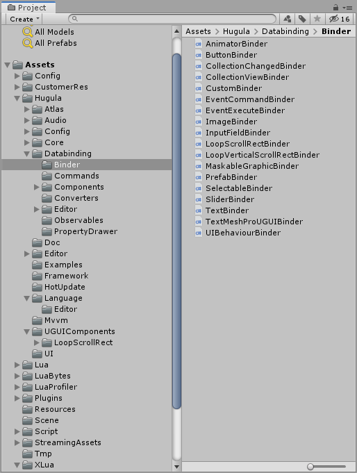
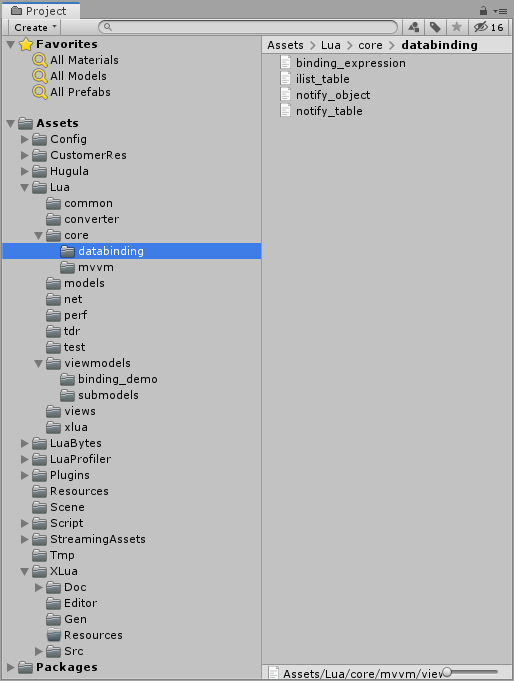
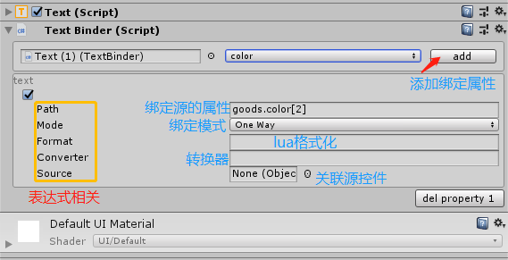

###Hugula(呼咕啦) 游戏框架 

Hugula(呼咕啦) 是一个面向unity3d的轻量级数据绑定框架，它提供简单的方式让游戏支持数据绑定，轻易做到逻辑与显示解耦。符合unity的DOTS方向。

## Hugula(呼咕啦)的特色
    1 轻量级的数据绑定，代码结构精简，支持单向双向绑定,C#对象与luatable的双向绑定,控件之间互相绑定。
    2 直接在界面操作数据绑定，支持表达式，format,convert，绑定模块基于lua，扩展方便。
    3 framework基于mvvm模式，引入模块group概念方便多模块整合。
    4 内置循环列表和自适应循环列表，面对大量数据显示无压力。
   
数据绑定demo演示

C# viewmodel 绑定示例

聊天功能演示

3. [帮助文档](https://github.com/tenvick/hugula/wiki)  交流qq群：19324776。

4. [mvvm 使用文档](https://github.com/tenvick/hugula/wiki/hugula-mvvm-%E4%BD%BF%E7%94%A8)
 

###安装与运行
1.初次运行需要生成xlua wrap code 菜单xlua->Generate Code。
2.打开场景s_begin即可。
#依赖
1. unity3d 推荐2019.3.0以上
2. xlua项目 地址 https://github.com/Tencent/xLua
3. 如需使用tools辅助功能 需要配置python2.7 lua5.3环境
#运行发布
1. xlua/Generate Code 先生成代码然后在运行
2. 一键发布 Hugula/Build For Publish (首次运行或者发布时候)
#开发与资源导出
1. AssetBundles/Build AssetBundles 导出assetbundle资源
2. Hugula/Debug Lua (开发模式)直接读取原始lua文件
3. AssetBundles/Simulation mode (开发模式)直接读取原始prefab
4. 选中资源右键AssetBundles/Set AssetBundle Name 设置prefab ab名。
5. Hugula/export lua [Assets\Lua]          打包编译脚本
6. Hugula/export config [Assets\Config]    打包配置
 

### 代码结构架构图
C#

lua

界面绑定
控件绑定示例

容器绑定示例，所有控件都必须添加到容器中继承容器的context

交流QQ群 19324776